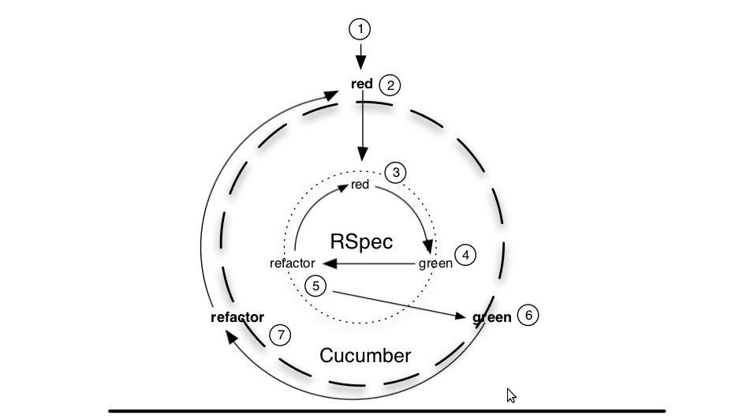

!SLIDE

# Do Rspec

## BDD with advanced Rspec

### Bogdan Gusiev
### 2011.04

!SLIDE

### Where we came from?

*TestUnit* a very *straight* unit test framework.
Unit testing was used for ages.

Unit test consists of:

* Workflow
* Assertions

!SLIDE 

### Where should we go?

##### Describe and test *business logic* 
##### in *agile development proccess*

!SLIDE

### We should remember that

* This presentation cover only *AGILE PROCESS*
  * This presentation cover RatePoint less than other projects
    * There are projects in Railsware outside of **RatePoint**
* Ruby or Rails is based on Ruby which is *object oriented* programming language.

!SLIDE code

### Describing the behavior in Rspec

Every **unit test** is a workflow

1. Step 1: Construct user with valid attributes
1. Step 2: Call save method
1. Assertion: Email confirmation letter is delivered.

Every *spec* is a requirement that consists of:

* *Subject*
  - New user with valid attributes
* *Context*
  - When saved
* *Behavior*
  -  Confirmation letter should be delivered

!SLIDE 

# *Subject* is a *code block*

### Desinged to be a convention. 

### Rather than create instance **variables** with **different names** 
!SLIDE

### Describe subject in rspec

Example:
@@@ ruby
    describe User do
        subject { User.new(@valid_attributes) }
        # or
        subject { Factory.build(:user)

        describe ".activated named scope" do
            subject { User.activated }
        end
    end
@@@

Default subject is: `described_class.new`

And that's for a reason. 

!SLIDE

### Describing behavior

Benefits of subject:

* Delegate expectation to subject
  * all *should* goes to subject by default
* Delegate custom methods to subject (#its)
  * we can specify behavior of some subject property

Matchers:

* Built-in
* Custom

!SLIDE

### Expectation usage example

@@@ ruby
    describe User do
        subject { build_user_with_factory }
        
        it { should be_valid }
        
        its(:profile) { should_not be_completed } # 2.0
        # subject.profile.completed?.should be_true
        
        its("tasks.first") {should be_a(FindFriendsTask)} # 2.0
        # subject.tasks.first.is_a?(FindFriendsTask).should be_true 

    end
@@@

!SLIDE

### New property emerged

## Description-less example

##### Examples description is a **maintenance** point we are trying to *reduce*

!SLIDE

### Matchers

Internal matchers:

* be\_\*
  * Accepts *any method* with question mark and it's arguments
* include
* ==

External libraries:

* Shoulda
* Remarkable

Beware: **copypaste** is not *BDD*!

!SLIDE

### Describe the context

<b>This is where the problem is!</b>

Rspec is designed to describe context-oriented logic

*Business logic* is always context oriented

Describe *non context-oriented logic* in rspec has **no benefits**

!SLIDE

### What is context dependent logic?

Context-oriented logic - from less context dependent to very context dependent:

* *Utility* functions
  * All math and any other function that doesn't data from nowhere except it's arguments.
* *Proxy* like objects and software
  * Sometimes have an inner state 
* *Stateful* software
  * databases and libraries that wrap them
* *Business* logic
  * That is what most of us do

!SLIDE 

### Rspec techniques to describe context

* Tools
  * \#let
  * \#context
* Techniques
  * nesting context blocks
  * Dynamic context
  * Context callbacks

!SLIDE 

## *\#let* function for dynamic context

### designed for *lazy loading* objects to the context as they needed

!SLIDE 

### Some source code

@@@ ruby
    def let(name, &block) 
        define_method name do 
            @assignments ||= {} 
            @assignments[name] ||= instance_eval(&block) 
        end 
    end
    
    def let!(name, &block) 
        let(name, &block) 
        before { __send__(name) } 
    end
    
    # sampe principle of lazy load for subject
    
    def subject
        if defined?(@original_subject)
            @original_subject
        else
            @original_subject = instance_eval(&self.class.subject)
        end
    end
 
@@@

!SLIDE 

### \#let basic usage example

@@@ ruby
    describe User do
        describe ".activated named scope" do
        
            subject { User.activated }
            
            let(:activated_user) { <factory> }
            let(:not_activated_user) { <factory> }
            
            it {should include(activated_user)
            it {should_not include(not_activated_user)
        end
    end 
@@@

!SLIDE 

### #let calls are chainable

@@@ ruby
    let(:user) { ... }
    let(:community) { ... }

    let(:membership) {
        Membership.new(
            :user => user, :community => community
        ) 
    } 
@@@

!SLIDE 

### Bang version of \#let

Will create user and at once load it to the context

@@@ ruby
    let!(:user) { ... }
@@@

!SLIDE 

### Nested #context

##### Designed to test *non-linear workflow*

!SLIDE 

### Nested context to test workflow

@@@ ruby
    describe Ticket do
      
      context "after save!" do
        
        it { should be_new }
        
        context "after approved  by admin" do
          it {should be_approved} 
        end
     
        context "after declined by admin" do
          it { should be_declined }
        end
    
      end
    end 
@@@

!SLIDE 
### New property

# Spec Outline 

!SLIDE 

### \#context + \#let = 

### Pattern Matches + Context Callbacks

!SLIDE 

### "Pattern matching" (c) S. Boiko

Use to describe utitlity functions

@@@ ruby
    describe BooleanExpression, ".run" do
    
        subject {BooleanExpression.run(string)}
        
        context "with '&' and both true" do
            let(:string) { "true & true" }
            it {should be_true }
        end
        
        context "with '&' and one false" do
            let(:string) { "false & true" }
            it {should be_false }
        end
    
    end 
@@@

!SLIDE 

### Most complicated example in this presentation

<pre style="font-family: monospace;">

    3

  2   
      4   6

        5
1           7
</pre>

@@@ ruby
    describe Product do
    
        subject { Factory.create(:product) }
        
        context "after save" do
        
        before { 
            subject.owner.confirmed = _confirmed
            subject.save!
        }
        
        context "when owner is confirmed" do
            let(:_confirmed) { true }
            it { should be_delivered }
        end
        
        context "when owner is not confirmed" do
            let(:_confirmed) { false }
            it { should_not be_delivered }
        end
    
    end
@@@

!SLIDE 

### Look and feel

@@@ ruby
    context "student" do

    let(:school) { Factory.create(:school) }

    let(:team) { Factory.create(:team, :school => school) }
    
    subject do
      Factory.create(:student, :team => team, :school => school)
    end

    it { should be_valid }

    context "match scheduler" do

      before { subject } 

      let!(:opponent) do
        Factory.create(:student, :team => team, :school => school)
      end

      let!(:competition) { Factory.create(:competition, :team => team) }

      its(:upcoming_matches) { should_not be_empty }
      its(:next_opponent)    { should == opponent } 
      its(:current_match)    { should be_nil } 
      its(:next_match)       { should == opponent.next_match }

      context "competition started" do
        before { competition.start! }
        its(:current_match) {should == competition.matches.first}
      end

      context "after_destroy" do
        before { subject.destroy }
        its(:team) { should_not be_destroyed }
      end

    end
  end 
@@@

@@@ ruby
    context "match scheduler" do

    before(:each) do
      school = Factory.create(:school)
      @team = Factory.create(:team, :school => school)
      @student1 = Factory.create(:student, :team => @team, :school => school)
      @student2 = Factory.create(:student, :team => @team, :school => school)
      @competition = Factory.create(:competition, :team => @team)
    end

    describe "upcoming_matches" do
      it "should return upcoming match for particular student" do
        @student1.upcoming_matches.first.id.should == @student2.upcoming_matches.first.id
      end
    end

    describe "next_opponent" do
      it "should return correct opponent for student" do
        @student2.next_opponent.should == @student1
        @student1.next_opponent.should == @student2
      end
    end

    describe "current_match" do
      it "should return started match for student" do
        @student1.current_match.should be_nil
        @competition.start!
        @competition.matches.first.id.should == @student1.current_match.id
      end
    end

  end   
@@@

!SLIDE 

##### Come back to: 

### Custom matchers

##### A class with very clean api recognized by Rspec

!SLIDE 

### Custom matcher that test validation

@@@ ruby
    describe User do 
        it { should accept_values_for(
            :email, "john@example.com", "lambda@gusiev.com"
        )}
        it { should_not accept_values_for(
            :email, "invalid", nil, "a@b", "john@.com"
        )} 
    end
@@@

[https://github.com/bogdan/accept\_values\_for](https://github.com/bogdan/accept_values_for)

There is a lot information on the web how to do that.

We won't describe it here just know that it is fast and easy

!SLIDE 

### Shared examples group

##### Rspec counterpart to Ruby .include

!SLIDE 

### SEG example

Use shared examples group to reuse tests

@@@ ruby
    class User
        include CommunityMember
    end
    
    describe User
        it_should_behave_like "CommunityMember"
        #Quotes can be remove in 2.0
    end
    
    shared_examples_group "CommunityMember" do
        context do
            it { should ..... }
        end
    end 
@@@

!SLIDE 

# Be abstract!

In order to make your tests reusable you need to:

* Subject is the same
* \#described\_class is described class
* All context staff get shared.
* 2.0 there is automatic subcontext for example group

!SLIDE 

### Shared examples group example

@@@ ruby
        
    shared_examples_for "Traits::Dictionary::Core" do
      describe "as Traits::Dictionary::Core" do
        it {should_not accept_values_for(:title, nil)}
    
        describe ".options_for_select" do
          let!(:object) do 
            Factory.create(described_class.to_s.underscore)
          end
          subject { described_class.options_for_select }
          it { should == [[object.title, object.id]]}
        end
      end
    end
@@@

!SLIDE 

### Power of SEG

We can do all kinds of staff in SEG:

* Delegate matchers and methods to subject
* Create an insance of decribed class with factory
* Call class methods

!SLIDE 

#### Summary

### We need to structure things we learned

!SLIDE image

#### Rspec book approach

!SLIDE 

### Read World

The following aspects are not touched in the book:

* Deadline
* Budget
* Client: "I want it right now"

The schema **not** considered for *Agile development*.

And very *good* for **elder** projects.

!SLIDE 

### My approach

The development lifecycle consists of the following steps:

* *Draft*    the code of the feature you plan to implement
* *Spec*     the code you wrote
* *Fix*      the issues in code and spec
* *Refactor* code and spec

Acceptance tests are used only after UI gets stable. 

<b>Always remember</b>

We are agile. 
Your *code* might *live* not more than **one day**.

!SLIDE 

### Summary: a **lot** of *text*

In order to describe business logic in agile development process we use the best tool designed for that -  *Rspec*, that offers cool api:

* Subject
* Matchers
* Context
* Let
* Shared examples group

That let *implement* the following *ideas*:

* Description-less examples
* Non-linear workflow spec
* Dynamic context
* Context callbacks
* Pattern matching

!SLIDE 

### The **end**

##### Bogdan Gusiev
##### http://gusiev.com
##### http://github.com/bogdan

